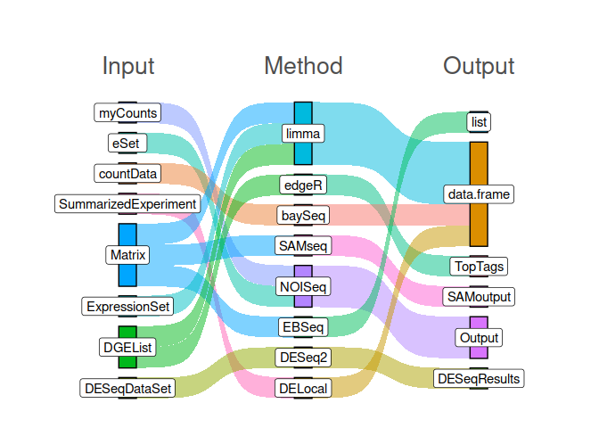
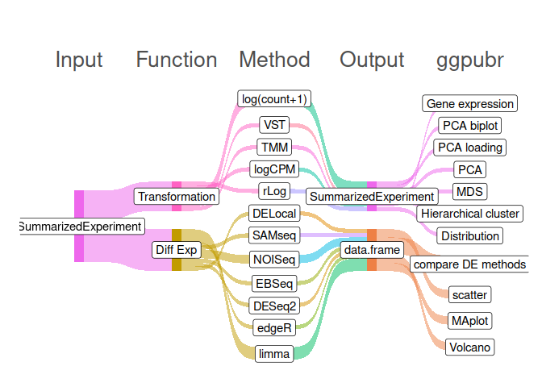

```{r, include = FALSE}
knitr::opts_chunk$set(
  collapse = TRUE,
  comment = "#>"
)
```

```{r setup, include = FALSE}
library(broadSeq)
```

To analyze RNA-seq **count** data, there are several ways/methods for each steps like

1.  transforming/scaling of the count data,

2.  QC by clustering and

3.  most importantly Differential expression of genes.

    Additionally for each of these steps, there are different packages or tools whose input and output structure is very different. Therefore it is very difficult to include useful features from different packages in a study.

```{r fig.cap = "Input and output data structures of different methods to idetify differentially expressed genes.",out.width = '70%', echo = FALSE}

```

#### The *broadSeq* package simplifies the process of including many RNAseq packages and evaluating their performance.

```{r out.width = '70%', echo = FALSE,fig.cap="Flowchart"}

```

The silent features of *broadSeq* are

-   **Single input format** : as well known [SummarizedExperiment](https://bioconductor.org/packages/release/bioc/html/SummarizedExperiment.html)
-   **Single output format** : as base `data.frame`
-   Visualization : Using `ggplot2` and `ggpubr` packages for publication ready figures
-   Easy and advanced PCA analysis
-   Function oriented interface to include in existing pipeline.
-   Differential expression
    -   Comparison of diff. methods

## Installation

You can install the development version of broadSeq from [GitHub](https://github.com/) with:

``` r
# install.packages("devtools")
devtools::install_github("dasroy/broadSeq")
```

<details>
<summary>sessionInfo</summary>

```{r echo=FALSE,message=FALSE,warning=FALSE,error=FALSE}
sessionInfo()
```
</details>
